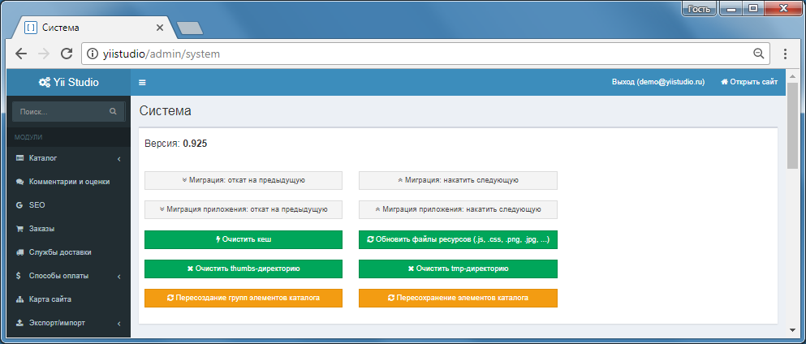

Миграции
===================

Yii Studio поддерживает миграции из Панели управления

- миграции системы (папка `admin\migrations\`)
- миграции каждого модуля (папка `admin\modules\<module>\migrations\`)
- миграции приложения (папка `your_app\migrations\`)

Информация о миграциях храниться в БД в таблицах с префиксом `migration_`.

