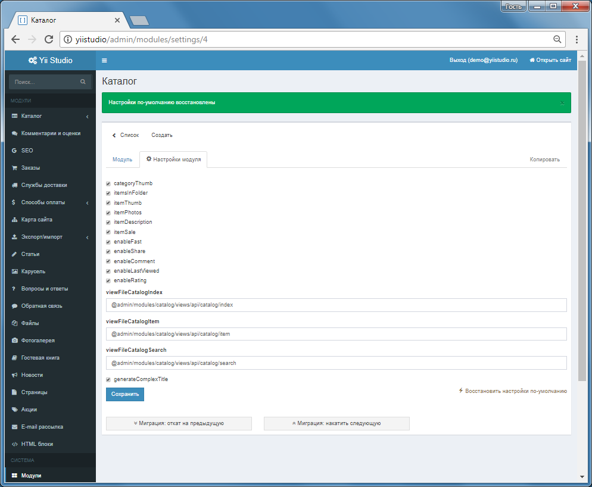

Настройки модулей
================

Каждый модуль может иметь настройки, которые хранятся в БД.

В классе модуля определите массив вида:

```php
public $settings = [
        'categoryThumb' => true,
        'itemsInFolder' => true,
        'itemThumb' => true,
        'itemPhotos' => true,
        'itemDescription' => true,
        'itemSale' => true,
        'enableFast' => true,
        'enableShare' => true,
        'enableComment' => true,
        'enableLastViewed' => true,
        'enableRating' => true,
        'viewFileCatalogIndex' => '@admin/modules/catalog/views/api/catalog/index',
        'viewFileCatalogItem' => '@admin/modules/catalog/views/api/catalog/item',
        'viewFileCatalogSearch' => '@admin/modules/catalog/views/api/catalog/search',
        'generateComplexTitle' => true,
        //Если нужно добавить подпункты в меню модуля в Панели управления
        '__submenu_module' => [
                ['id' => 'a', 'url' => '/admin/catalog/a', 'label' => 'Категории'],
                ['id' => 'brand', 'url' => '/admin/catalog/brand', 'label' => 'Бренды'],
        ]
    ];
```

Перейдите на страницу Панель управления - Модули - Модуль - Настройки модуля. 
Нажмите кнопку Восстановить настройки по-умолчанию, добавленные настройки появятся в интерфейсе.


