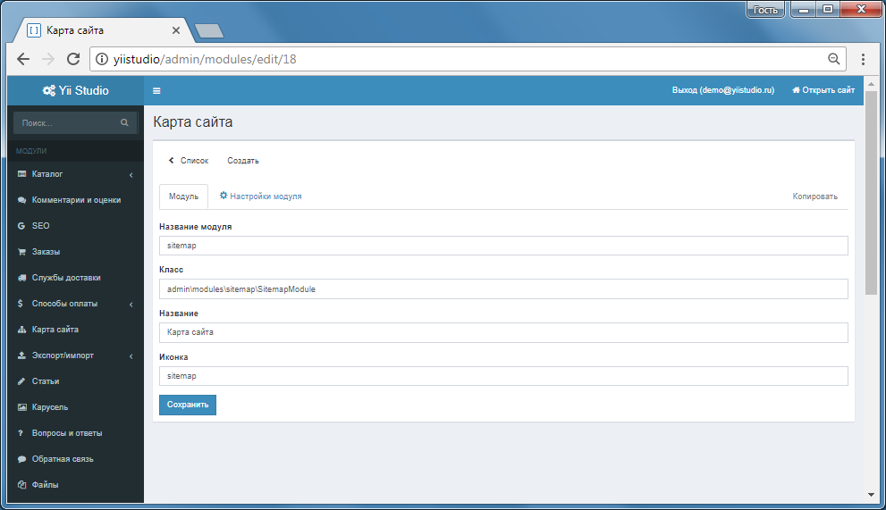

Модули
=======

Встроенные модули системы
------------------------------------------

[Каталог](module-catalog.md) `admin\modules\catalog\CatalogModule`

Иерархическая структура категорий и элементов. Настройка произвольных свойств категорий и элементов.

[Корзина](module-shopcart.md) `admin\modules\shopcart\ShopcartModule`

Работа с корзиной, оформление заказа, управление своими заказами. Изменение статусов заказа в Панели управления, отправка уведомлений пользователю.

[Службы доставки](module-delivery.md) `admin\modules\delivery\DeliveryModule`

Создание, удаление, редактирование служб доставки, привязка способов оплаты к службам доставки, ограничение по минимальной цене заказа при использовании службы доставки.

[Способы оплаты](module-payment.md) `admin\modules\payment\PaymentModule`

Ручной - без онлайн-оплаты, статус "Оплачено" меняется только через Панель управления; Автоматические: прием денег через Яндекс.Деньги, Яндекс.Касса.

[Акции](module-sale.md) `admin\modules\sale\SaleModule`

Управление акциями магазина, автоматическое создание баннера акции.

[Страницы](module-page.md) `admin\modules\page\PageModule`

Управление страницами сайта, название, текст, SEO.

[Комментарии и оценки](module-comment.md) `admin\modules\comment\CommentModule`

Пользовательские комментарии с привязкой к комментируемому объекту, модерация комментариев администраторами, "star" рейтинг, от 0 до 5 баллов.

[Экспорт/импорт](module-yml.md) `admin\modules\yml\YmlModule`

Импорт каталогов в формате YML, импорт категорий, элементов, новостей, пользователей в формате Excel, экспорт каталога в Excel, YML.

[SEO](module-seo.md) `admin\modules\seo\SeoModule`

SEO шаблоны для title, h1, description, keywords.

[Карта сайта](module-sitemap.md) `admin\modules\sitemap\SitemapModule`

Автоматическая генерация карты сайта.

[Статьи](module-article.md) `admin\modules\article\ArticleModule`

Иерархическая структура разделов и статей, краткий текст, полный текст, количество просмотров, прикрепление тегов, прикрепление фотографий.

[Новости](module-news.md) `admin\modules\news\NewsModule`

Иерархическая структура новостей, краткий текст, полный текст, количество просмотров, прикрепление фотографий.

[Обратная связь](module-feedback.md) `admin\modules\feedback\FeedbackModule`

Форма обратной связи, ответ из Панели управления, заказ обратного звонка.

[Вопросы и ответы (FAQ)](module-faq.md) `admin\modules\faq\FaqModule`

Раздел частозадаваемых вопросов.

[Файлы](module-file.md) `admin\modules\file\FileModule`

Управление публикуемыми файлами, доступ, формирование ссылки на скачивание.

[Фотогалерея](module-gallery.md) `admin\modules\gallery\GalleryModule`

Модуль управления фотогаллереями.

[Гостевая книга](module-guestbook.md) `admin\modules\guestbook\GuestbookModule`

Записи на сайте, модерация.

[HTML-блоки](module-block.md) `admin\modules\block\BlockModule`

Произвольный HTML-код, поддержка "live-edit".

[Карусель](module-carousel.md) `admin\modules\carousel\CarouselModule`

Фотогаллерея на главной странице с различными эффектами прокрутки.

[E-mail рассылка](module-subscribe.md) `admin\modules\subscribe\SubscribeModule`
 
Подписка пользователей на рассылку, массовая рассылка, шаблоны писем.

Страница управления модулями в Панели управления.


Создание модулей
------------------------------------------

Для добавления модуля в интерфейс Панели управления системы, перейдите Панель управления - Модули, кнопка Создать.
Укажите код, название, путь к классу и иконку модуля.

Страница основных настроек модуля в Панели управления.



Переведите ползунок статуса модуля в положение Вкл., после этого меню модуля отобразится в меню Панели управления.

Стандартные модули системы размещается в директории `admin\modules\`.
Модули приложения можно разместить в директории `your_app\modules\`. 

Структура стандартного модуля системы (например, модуль Корзина):

```
shopcart/                   корневая папка модуля    
    api/                    API-объекты модуля (для поддержки Live-edit)
    commands/               консольные команды модуля
    controllers/            контроллеры модуля
    export/
    helpers/                хелперы модуля    
    mail/                   содержит виды для почтовых отправлений модуля (могут быть переопредены в папке your_app/mail/)
    media/                  содержит css, js, png, ... подключаемые модулем
    messages/               файлы переводов
    migrations/             миграции модуля
    models/                 модели модуля   
    views/                  виды модуля
    ShopcartModule.php      файл класса модуля (в нем определяются настройки модуля)
```

Классы модулей
------------------------------------------

Каждый модуль объявляется с помощью уникального класса, который наследуется от [[\admin\components\Module]].

Пример класса модуля Корзина:

```php
<?
namespace admin\modules\shopcart;

class ShopcartModule extends \admin\components\Module
{
    public $settings = [
        'notifyAdmin' => true,
        'subjectNotifyAdmin' => 'Новый заказ №##order_id##',
        'templateNotifyAdmin' => '@admin/modules/shopcart/mail/ru/notify_admin',
        'subjectNotifyUser' => 'Заказ №##order_id##',
        'templateNotifyUser' => '@admin/modules/shopcart/mail/ru/notify_user',
        'frontendShopcartOrderRoute' => '/shopcart/order',
        'frontendShopcartRoute' => '/shopcart',
        'enableName' => true,
        'enablePhone' => true,
        'templateShopcartIndex' => '@admin/modules/shopcart/views/api/shopcart/index',
        'templateShopcartOrder' => '@admin/modules/shopcart/views/api/shopcart/order',
        'templateShopcartOrders' => '@admin/modules/shopcart/views/api/shopcart/orders',
        'templateShopcartSuccess' => '@admin/modules/shopcart/views/api/shopcart/success',
        'templateShopcartSuccessGuest' => '@admin/modules/shopcart/views/api/shopcart/success_guest',
        'templateShopcartSuccessPayment' => '@admin/modules/shopcart/views/api/shopcart/success_payment',
        'templateShopcartFast' => '@admin/modules/shopcart/views/api/shopcart/fast',
        'modelExportOrderToExcel' => 'admin\modules\shopcart\export\OrderToExcel',
    ];

    public static $installConfig = [
        'title' => [
            'en' => 'Orders',
            'ru' => 'Заказы',
        ],
        'icon' => 'shopping-cart',
        'order_num' => 101,
    ];
}
```
