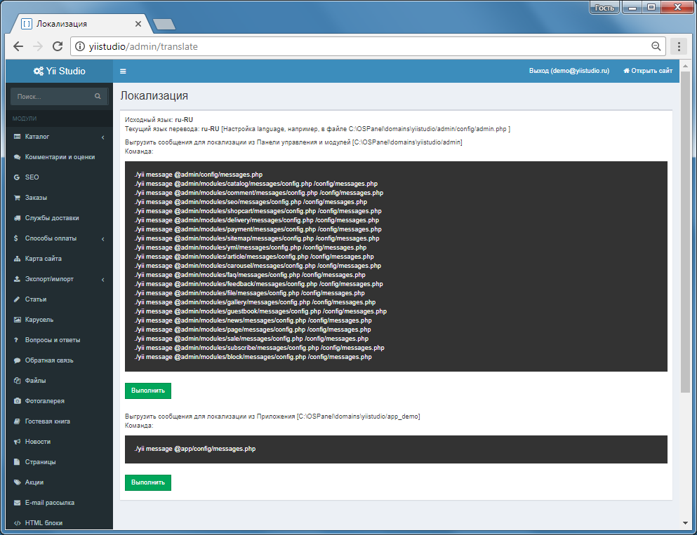

Интернационализация
====================

В общем конфиге admin/config/admin.php задайте текущий язык (также можно переопределить в конфиге приложения  app_demo/config/web.php)

```php
$config = [
...
'language' => 'ru-RU' 
...
]
```

Для автоматического извлечения сообщений для перевода можно использовать подготовленные конфиги и команду ./yii/message из Панель управления - Локализация.
Например, для извлечения сообщений для нового языка перевода (fr-FR) из Панели управления и модулей в файле @admin/messages/<язык>/admin.php добавьте

```php
return [
...
'languages' => ['en-US','fr-FR'],
...
]
```

Файлы с переводом по умолчанию генерируются:
* для Панели управления - `admin/messages/<язык>/admin.php`
* для модулей - `admin/modules/<название модуля>/messages/<язык>/<название модуля>.php`
* для Приложения - `your_app/messages/<язык>/app.php`


