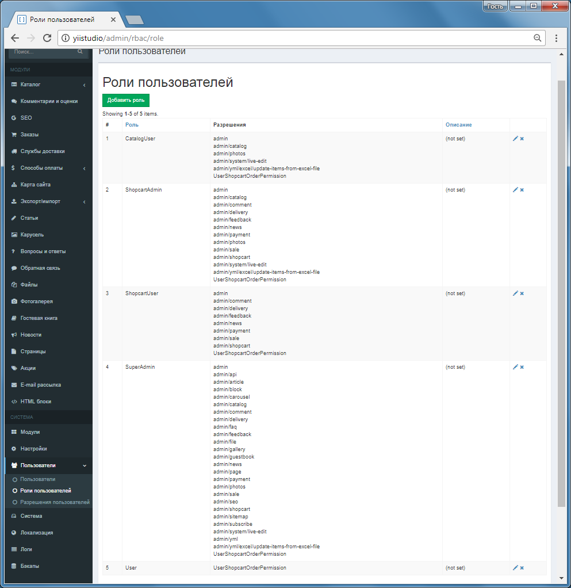

Управление пользователями, доступ на основе ролей и разрешений
===========

В основном Yii Studio использует контроль доступа на основе ролей (RBAC).

Фильтр контроля доступа используется для роли `SuperAdmin` в модуле Панели управления `admin/AdminModule`.

```php
    ...
    return [
                'AccessBehavior' => [
                    'class' => AccessBehavior::className(),
                    'login_url' => '/user/login',
                    'rules' =>
                    [
                        'admin' => [['allow' => true, 'roles' => ['SuperAdmin'],],],
                        'admin/logs' => [['allow' => true, 'roles' => ['SuperAdmin'],],],
                        'admin/modules' => [['allow' => true, 'roles' => ['SuperAdmin'],],],
                        'admin/photos' => [['allow' => true, 'roles' => ['SuperAdmin'],],],
                        'admin/redactor' => [['allow' => true, 'roles' => ['SuperAdmin'],],],
                        'admin/session' => [['allow' => true, 'roles' => ['SuperAdmin'],],],
                        'admin/settings' => [['allow' => true, 'roles' => ['SuperAdmin'],],],
                        'admin/system' => [['allow' => true, 'roles' => ['SuperAdmin'],],],
                        'admin/tags' => [['allow' => true, 'roles' => ['SuperAdmin'],],],
                        'admin/translate' => [['allow' => true, 'roles' => ['SuperAdmin'],],],
                        'admin/user-permissions' => [['allow' => true, 'roles' => ['SuperAdmin'],],],
                        'admin/users' => [['allow' => true, 'roles' => ['SuperAdmin'],],],
                        'admin/dump' => [['allow' => true, 'roles' => ['SuperAdmin'],],],
                        'admin/user' => [['actions' => ['logout'], 'allow' => true, 'roles' => ['@'],],],
                    ],
                ],
            ]
    ...
```

В остальных случаях используется RBAC.

Для инициализации системы ролей и разрешений используется команда 

```
yii rbac/init [--user_id]
```

Или Панель управления - Роли пользователей - Инициализация RBAC по умолчанию

При инициализации создается 5 ролей пользователей и устанавливаются разрешения:
- User (роль по умолчанию, присваивается всем зарегестрированным пользователям)
- CatalogUser
- ShopcartUser
- ShopcartAdmin
- SuperAdmin

В Панели управления вы можете добавить разрешения, роли, выставить соответствие ролей и разрешений.

