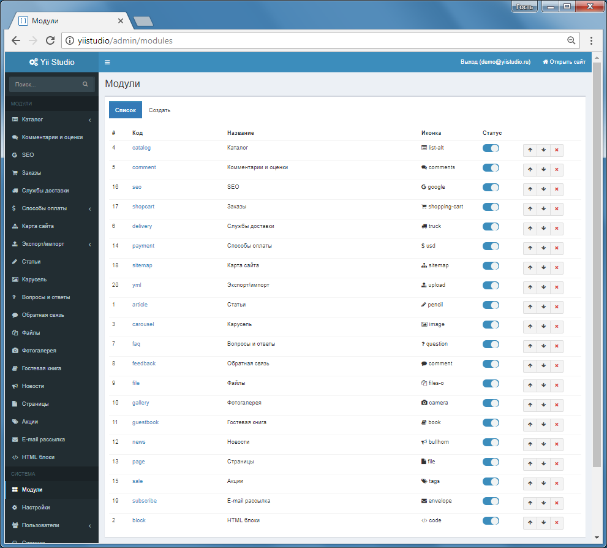

Что такое Yii Studio?
==============

Yii Studio – быстрая и удобная система управления контентом (CMS), отлично подойдет для интернет-магазина, сайта-визитки, может быть легко изменена под выполнение различных задач. 
      
Функционал:            
* Управление модулями (добавление, отключение, настройки модулей)
* Управление пользователями, доступ на основе ролей и разрешений (RBAC)
* Управление глобальными настройками системы
* Очистка кеша, пересоздание файлов ресурсов из панели управления
* Управление миграциями БД
* Выполнение консольных команд
* Поддержка режима "live-edit" - при включении режима большинство элементов публичной части, становятся редактируемыми
* Локализация
* Журнал событий

Встроенные модули системы
------------------------------------------

[Каталог](module-catalog.md)
Иерархическая структура категорий и элементов. Настройка произвольных свойств категорий и элементов.

[Корзина](module-shopcart.md)
Работа с корзиной, оформление заказа, управление своими заказами. Изменение статусов заказа в Панели управления, отправка уведомлений пользователю.

[Службы доставки](module-delivery.md)
Создание, удаление, редактирование служб доставки, привязка способов оплаты к службам доставки, ограничение по минимальной цене заказа при использовании службы доставки.

[Способы оплаты](module-payment.md)
Предоставляет различные способы оплаты

[Акции](module-sale.md)
Управление акциями магазина, автоматическое создание баннера акции.

[Страницы](module-page.md)
Управление страницами сайта, название, текст, SEO.

[Комментарии и оценки](module-comment.md)
Пользовательские комментарии с привязкой к комментируемому объекту, модерация комментариев администраторами, "star" рейтинг, от 0 до 5 баллов.

[Экспорт/импорт](module-yml.md)
Импорт каталогов в формате YML, импорт категорий, элементов, новостей, пользователей в формате Excel, экспорт каталога в Excel, YML.

[SEO](module-seo.md)
SEO шаблоны для title, h1, description, keywords.

[Карта сайта](module-sitemap.md)
Автоматическая генерация карты сайта.

[Статьи](module-article.md)
Иерархическая структура разделов и статей, краткий текст, полный текст, количество просмотров, прикрепление тегов, прикрепление фотографий.

[Новости](module-news.md)
Иерархическая структура новостей, краткий текст, полный текст, количество просмотров, прикрепление фотографий.

[Обратная связь](module-feedback.md)
Форма обратной связи, ответ из Панели управления, заказ обратного звонка.

[Вопросы и ответы (FAQ)](module-faq.md)
Раздел частозадаваемых вопросов.

[Файлы](module-file.md)
Управление публикуемыми файлами, доступ, формирование ссылки на скачивание.

[Фотогалерея](module-gallery.md)
Модуль управления фотогаллереями.

[Гостевая книга](module-guestbook.md)
Записи на сайте, модерация.

[HTML-блоки](module-block.md)
Произвольный HTML-код, поддержка "live-edit".

[Карусель](module-carousel.md)
Фотогаллерея на главной странице с различными эффектами прокрутки.

[E-mail рассылка](module-subscribe.md) 
Подписка пользователей на рассылку, массовая рассылка, шаблоны писем.

Страница управления модулями в Панели управления.

