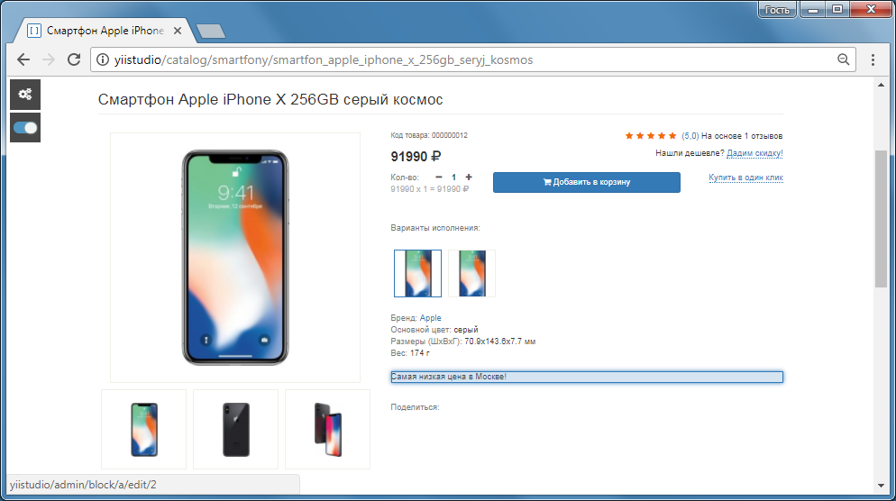
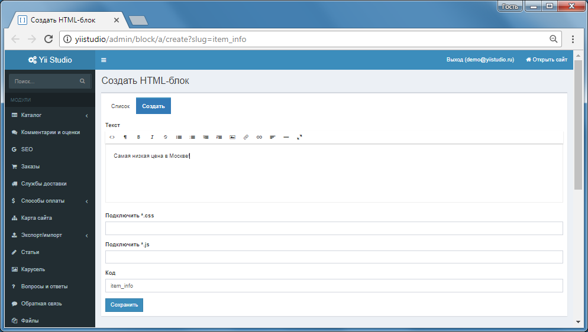

Модуль HTML-блоки
====================

Произвольный HTML-код, поддержка "live-edit".

Сайт, режим live-edit, при наведении подсвечивается html-блок, по щелчку, переход к редактированию в Панели управления.

Панель управления: редактирование содержимого html-блока

