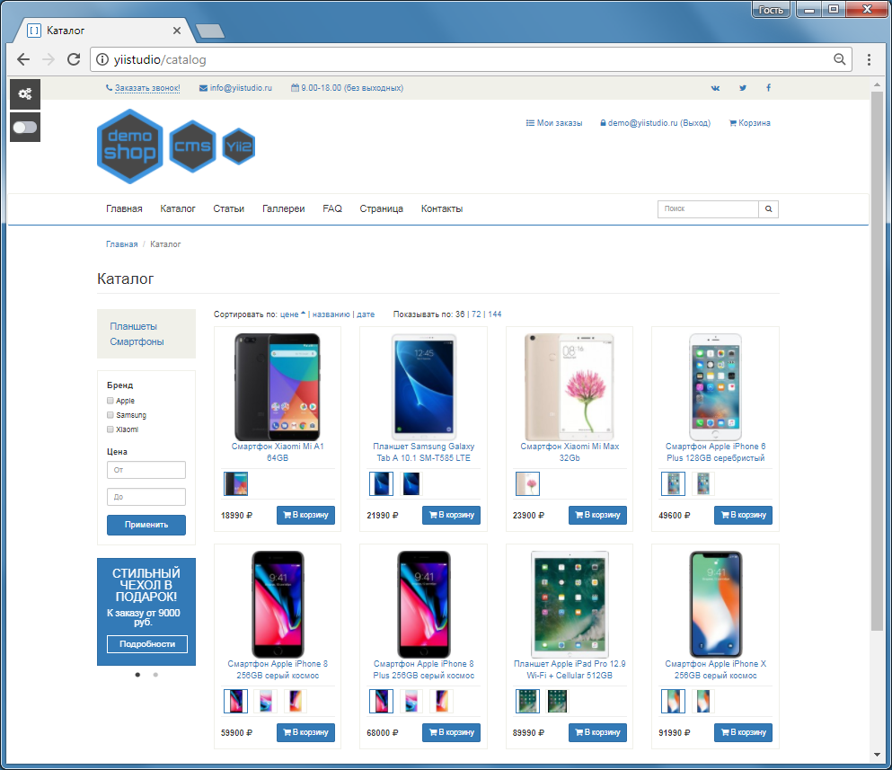
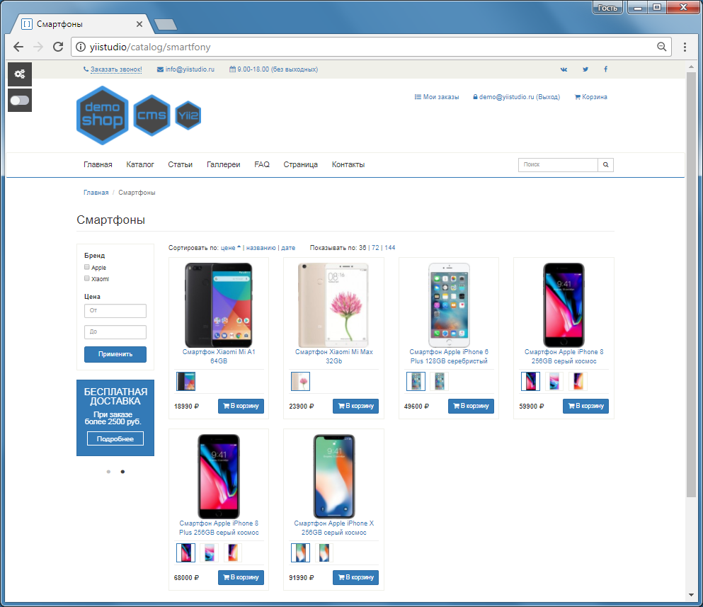
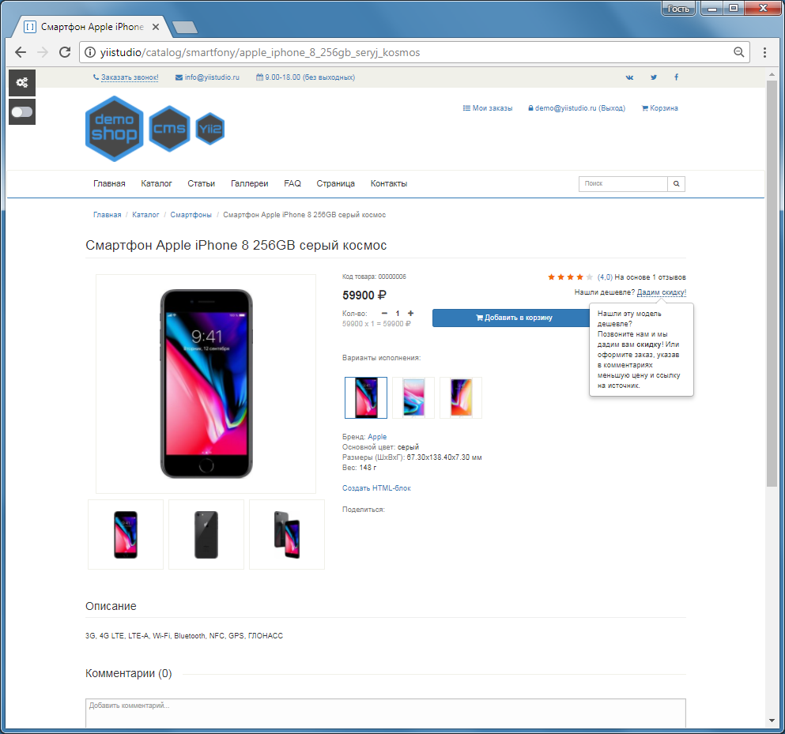
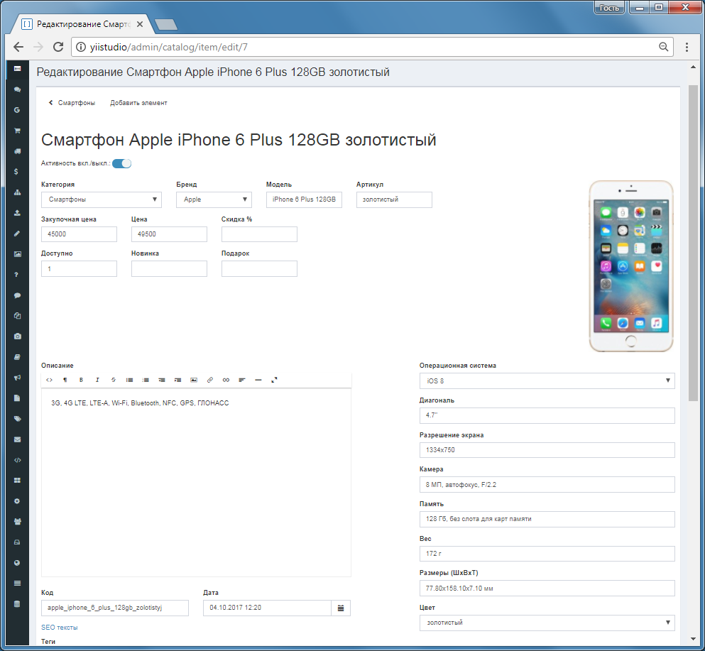
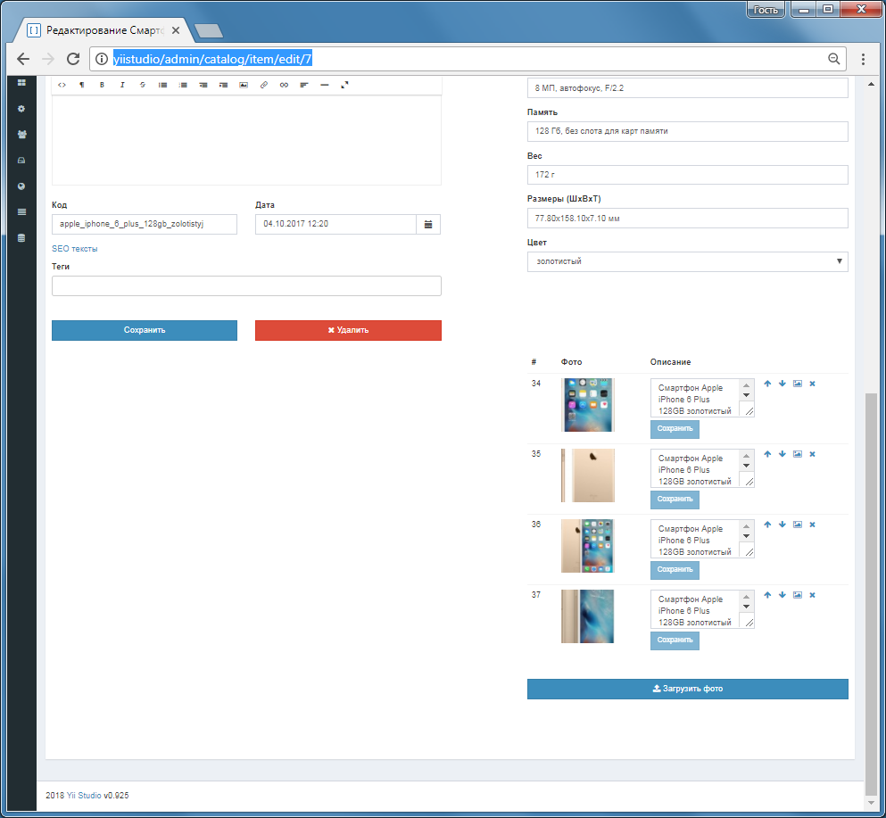
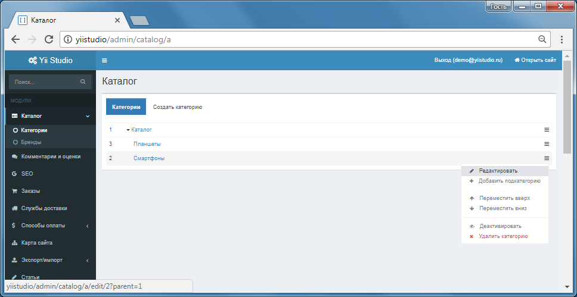
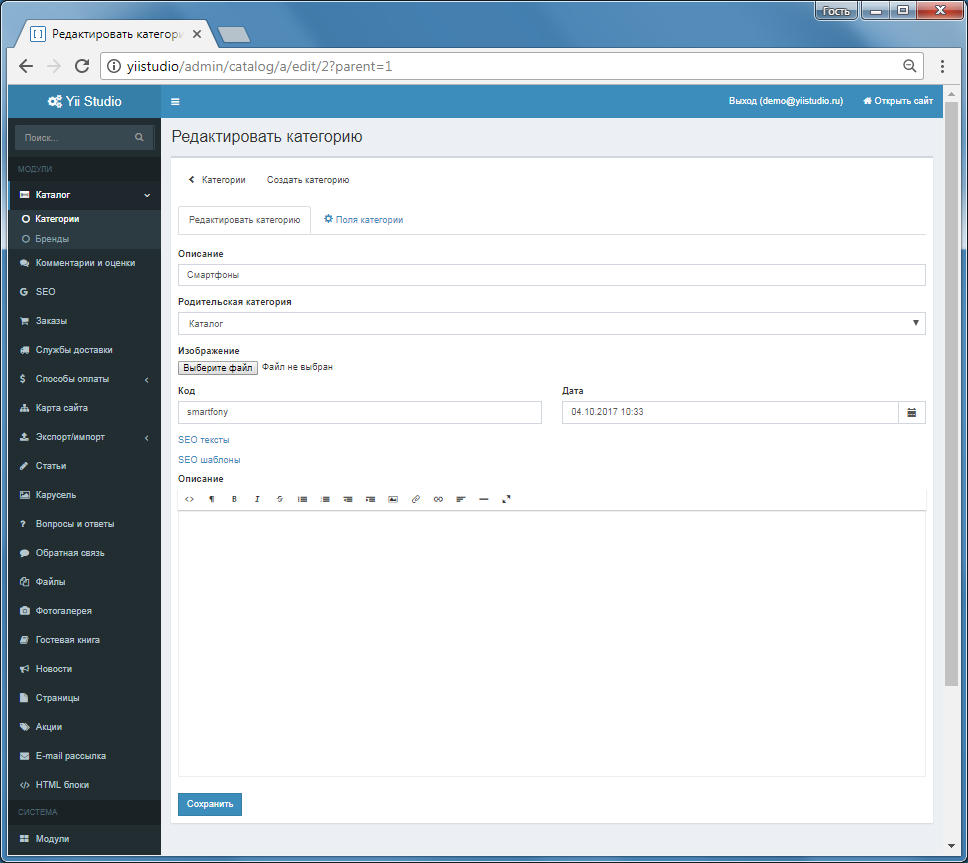
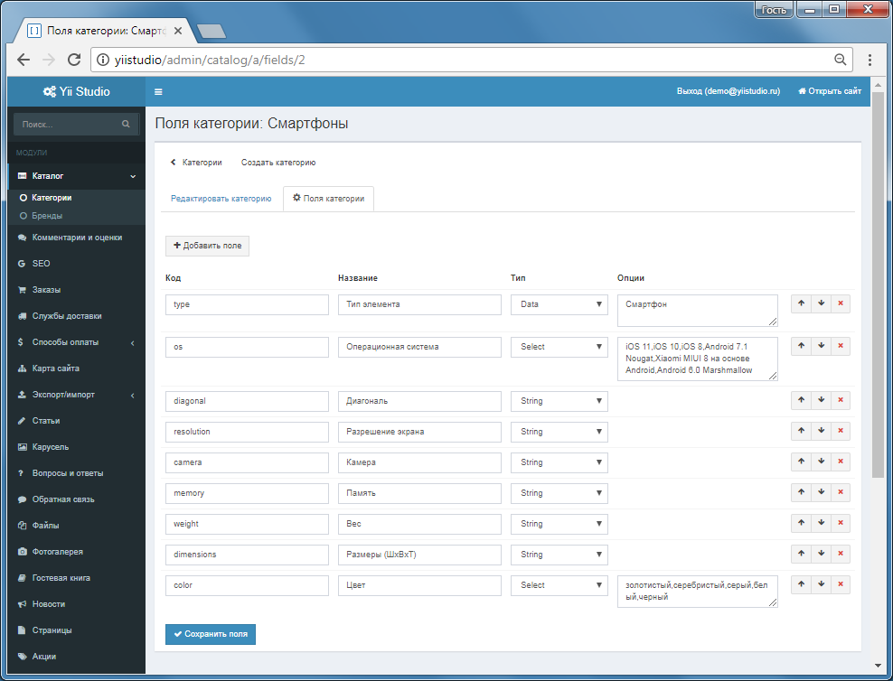
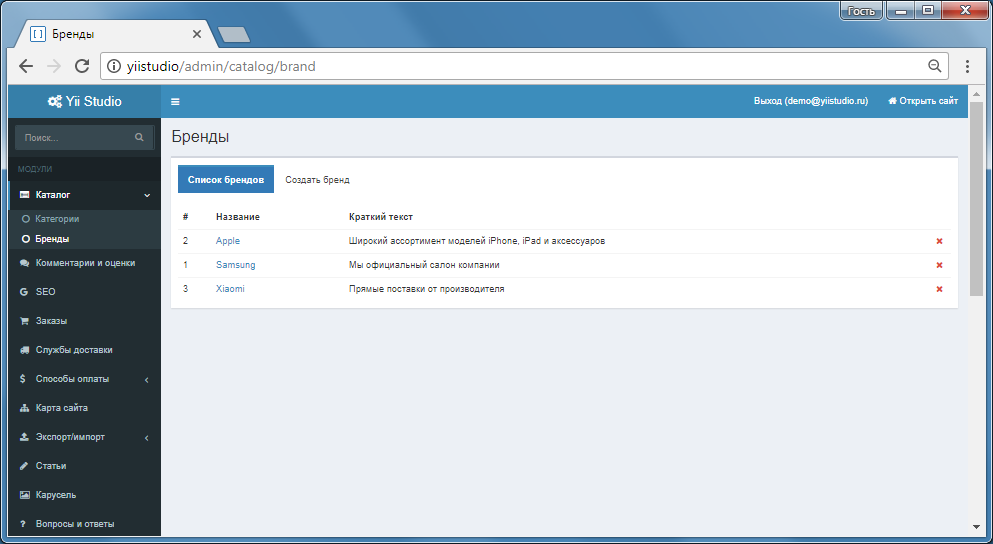

Модуль Каталог
====================

Иерархическая структура категорий и элементов. Настройка произвольных свойств категорий и элементов.

Страница "Каталог"

Страница "Категория каталога"

Страница "Элемент каталога"

Панель управления: категория каталога

Панель управления: редактирование свойств элемента каталога

Панель управления: управление фотографиями элемента каталога

Панель управления: меню для редактирования

Панель управления: редактирование категории

Панель управления: дополнительные поля для категории

Панель управления: список брендов

