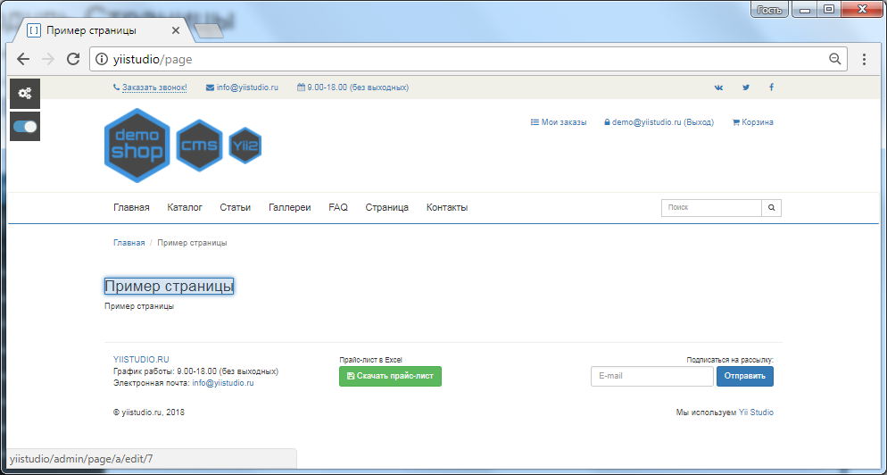
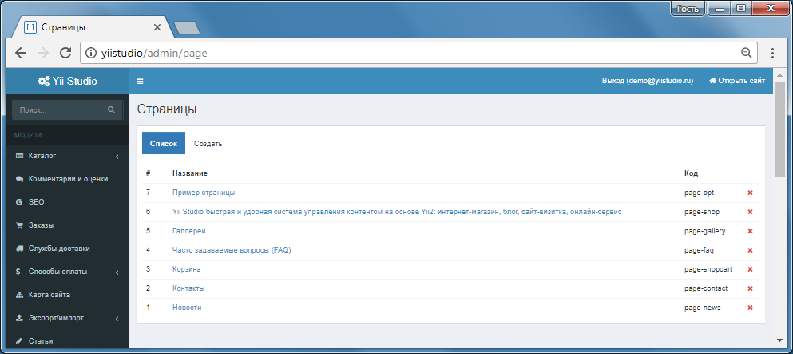
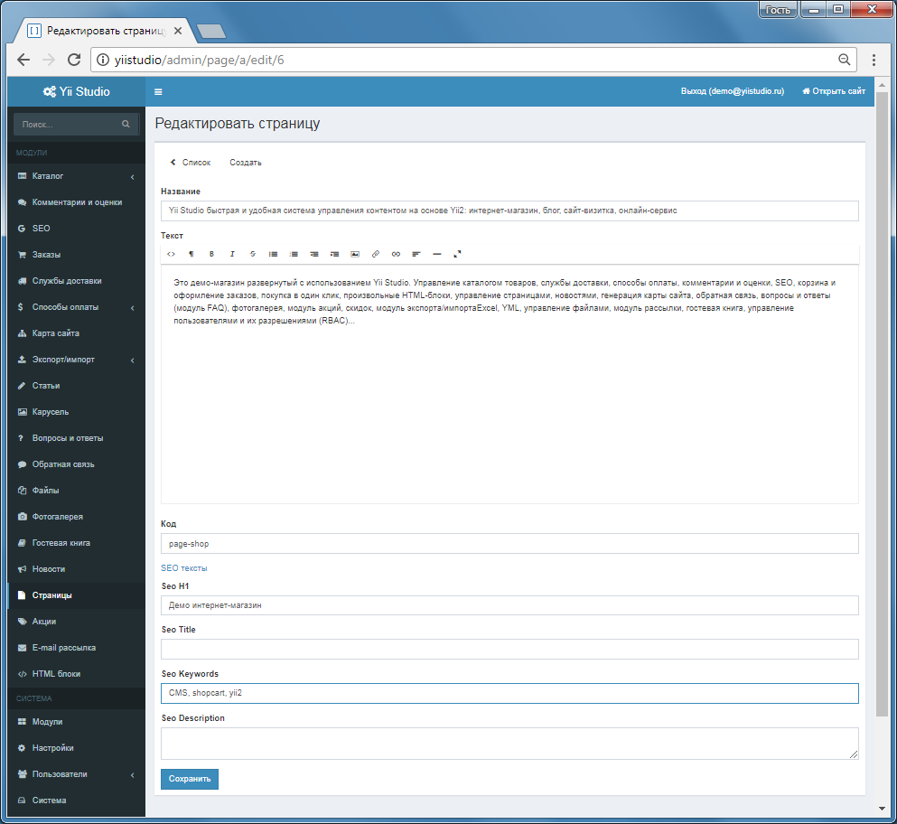

Модуль Страницы
====================

Управление страницами сайта, название, текст, SEO.

Сайт, режим live-edit, при наведении подсвечивается заголовок или текст, по щелчку, переход к редактированию в Панели управления.

Панель управления: список страниц

Панель управления: редактирование страницы

