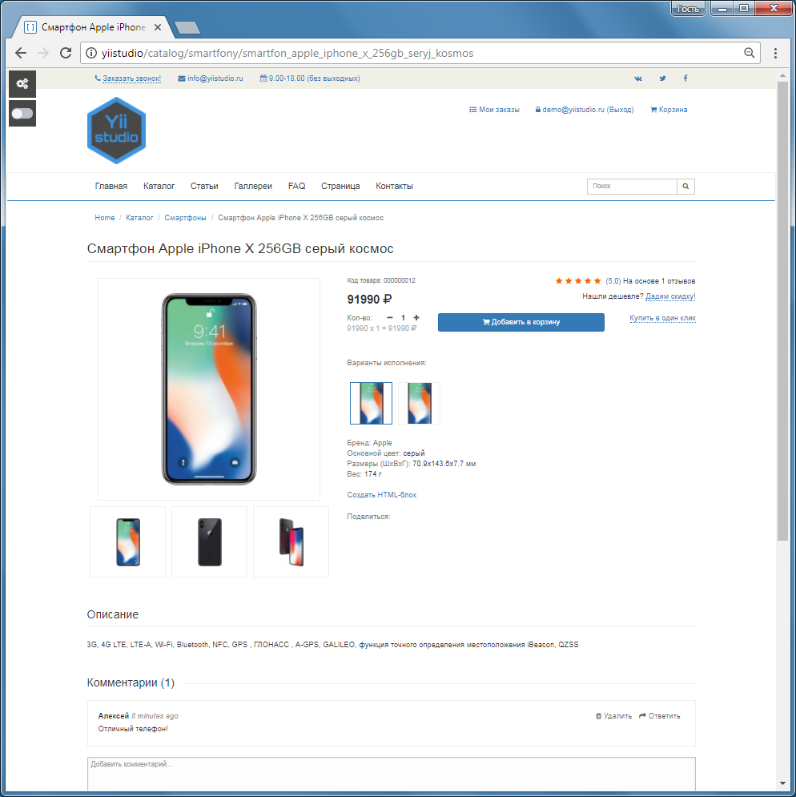

Запуск приложения
====================

 После установки Yii Studio  демо-приложение будет доступно по URL `http://hostname`, панель управления доступна по адресу `http://hostname/admin`

Функциональность
---------------

Установленный шаблон демо-приложения представляет из себя готовый интернет-магазин состоящий из страниц:

* стартовая страница, отображается при переходе по URL `http://hostname`
* страница "Каталог" (`http://hostname/catalog`)
* страница "Категория" (`http://hostname/catalog/<код_категории>`)
* страница "Карточка товара" (`http://hostname/catalog/<код_категории>/<код_товара>`)
* страница "Статьи" (`http://hostname/article/all`)
* страница "Галлереи" (`http://hostname/gallery`)
* страница "FAQ" (`http://hostname/faq`)
* страница "Пример страницы" (`http://hostname/page`)
* страница "Контакты" с формой обратной связи (`http://hostname/contact`)
* страница "Входа пользователя" (`http://hostname/user/login`)
* страница "Регистрации пользователя" (`http://hostname/user/registration`)
* страница "Сброса пароля пользователя" (`http://hostname/user/request-password-reset`)

Эти страницы используют смежный хедер (шапка сайта) и футер (подвал). В "шапке" находится главное меню, кнопка заказа обратного звонка. В "подвале" - копирайт и общая информация, форма для подписывания на рассылку, кнопка скачивания прайс-листа

Если пользователь авторизован, то ему доступна страница "Мои заказы" (`http://hostname/shopcart/orders`).

Если пользователь авторизован с правами позволяющими ему работать с Панелью управления, то в левом верхнем углу он увидит группу кнопок:
* Вход в Панель управления
* Переключение режима LiveEdit 

Если включена отладка, то будут отображены дополнительные кнопки:
* Очистить кеш
* Обновить файлы ресурсов (.js, .css, .png, .jpg, ...)
* Кнопка панели отладки

