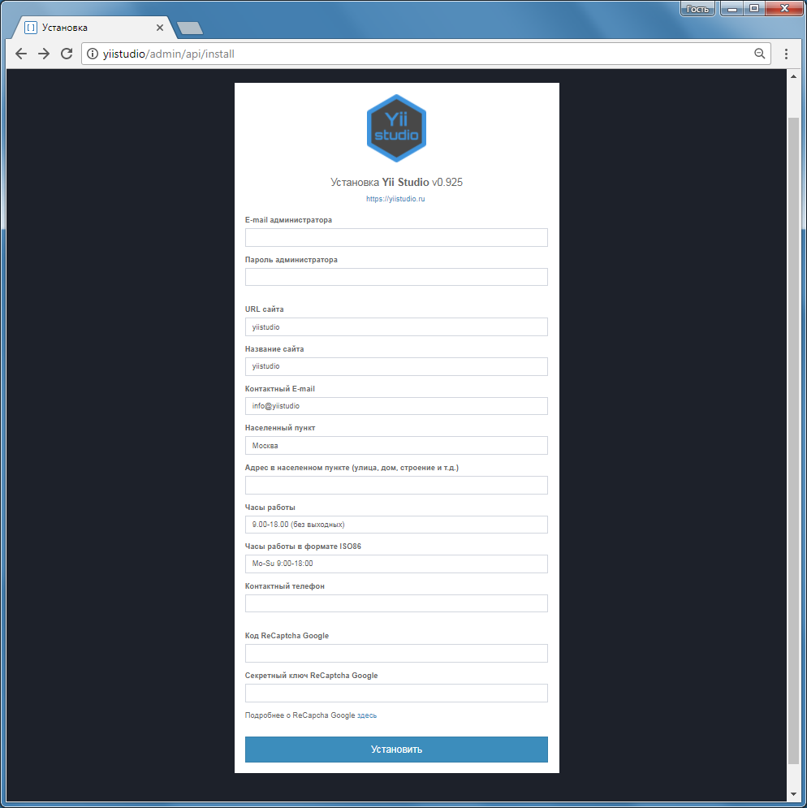
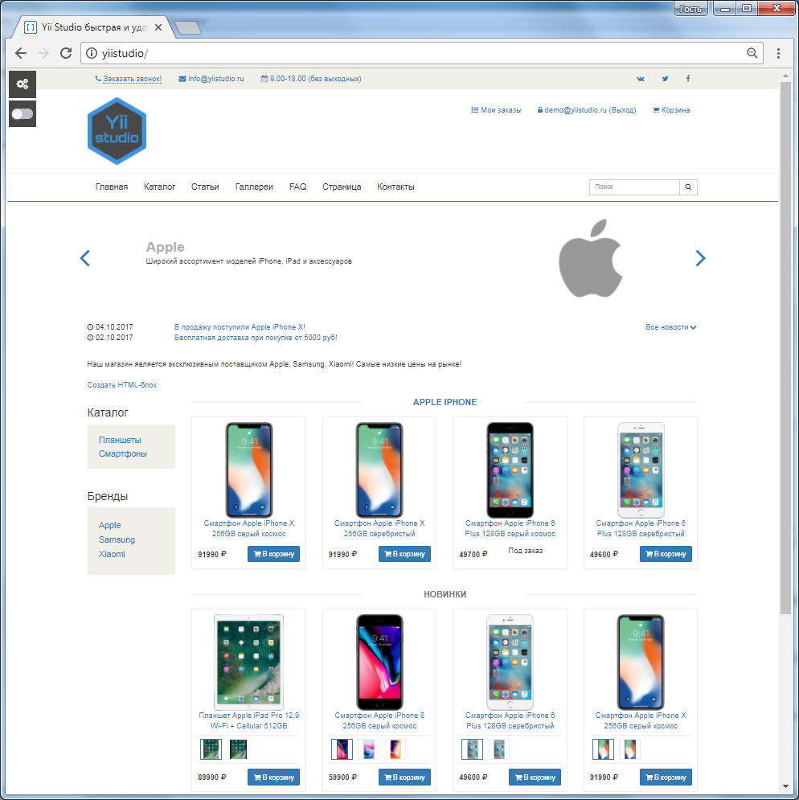

Установка Yii Studio
==============

Установка
----------
1. Забираем проект

```bash
git clone https://github.com/studio451/yiistudio.git
```

2. Устанавливаем зависимости

```bash
cd yiistudio 
composer install
```
или 

```bash
cd yiistudio 
php composer.phar install
```

3. Открываем app_demo/config/web.php и меняем значение параметра cookieValidationKey на свой случайно сгенерированный (например, с помощью [random.org](https://www.random.org/strings/?num=10&len=20&digits=on&upperalpha=on&loweralpha=on&unique=on&format=html&rnd=new)).
4. Настраиваем подключение к БД в файле app_demo/config/db_dev.php (для прода app_demo/config/db.php). База данных должна быть создана заранее.
5. Открываем в браузере сайт. Заполняем необходимые данные на странице установки.



6. После установки меняем значение константы INSTALLED во [входном скрипте](structure-entry-script.md) на true.
7. Обновляем страницу установки


После установки Вы можете перейти в Панель управления или на стартовую страницу демо-приложения


Установка демо-данных
----------
  * Выполните скрипт app_demo/demo_data/db_demonstration_data.sql
  * Замените содержимое папки public_html/demo_data/uploads содержимым архива app_demo/demo_data/public_html__uploads_demo_files.zip
  * Обновите кеш. Например, через Панель управления - Система - Очистить кеш.
  * Обновите assets. Например, через Панель управления - Система -  Обновить файлы ресурсов (.js, .css, .png, .jpg, ...).

